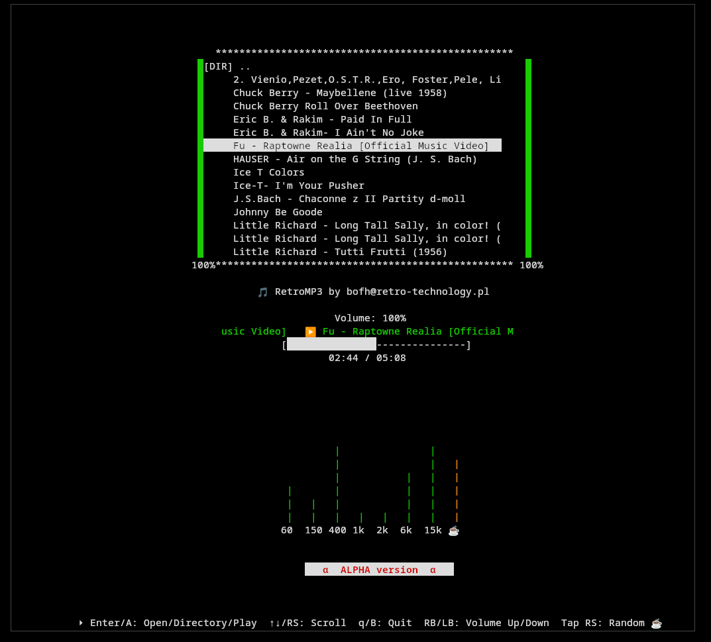

# RetroMp3 🎶

  

**Status:** Alpha / Binary-only release  
**Author:** jms@data.pl, bofh@retro-technology.pl  
**License:** Proprietary – see [LICENSE.txt](LICENSE.txt)

---

## ℹ️ About
RetroMp3 is an experimental MP3 playback and management tool.  
This repository provides **binary-only test releases** – the source code is **not public**.  
The current builds are for testing and evaluation only.

Future versions will be available under a **commercial license**.

---

## 🚀 Usage
1. Download the latest release from the [Releases](../../releases) page.  
2. Extract the archive for your platform (Linux/NetBSD/…).
3. Run the binary as a regular user.  

⚠️ **Warning:** This is an alpha version – expect bugs and incomplete functionality.

---

## 📜 License
- Proprietary, testing-only license.  
- Redistribution, modification, reverse engineering, and commercial use are **strictly prohibited**.  
- Full license text: [LICENSE.txt](LICENSE.txt)

---

## 🐞 Reporting issues
If you encounter bugs or crashes, please open an [Issue](../../issues) on GitHub,  
or contact the author directly at **jms@data.pl**.

---

## 🔮 Roadmap
- [ ] Bug fixes from alpha testing  
- [ ] Improved playback engine  
- [ ] Cross-platform builds  
- [ ] Commercial release

---

## 🎛️ The Trick

There is a trick – if you don't have an arcade stick **joycart**,  
the volume in the program won't work for you ;]

---

## 💸 Wsparcie

If you want to support the development of RetroMp3, you can buy me a coffee via Tipply:

